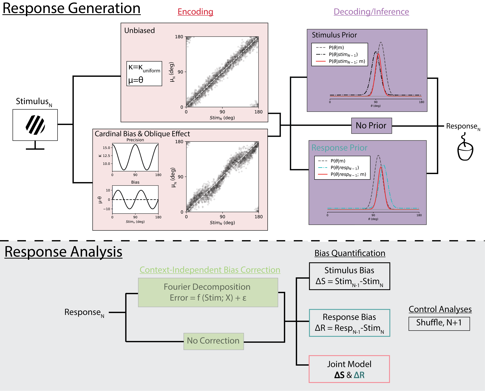

# histroryResponseModeling
`Code & data necessary to replicate:` [Distinguishing response from stimulus driven history biases](https://www.biorxiv.org/content/10.1101/2023.01.11.523637v1.abstract) (preprint)

### Broad Summary: 
The field of *causal inference* seeks to determine the underlying causal graph connecting observable phenomenon. A necessary (but non-sufficient) factor for one process to cause another is that the two observable variables are correlated. We further demand that this correlation is not mediated by a third unobserved factor. In this study, we tackle a very specific question: *how can we know whether perceptual biases towards the past are driven by previously seen stimuli or by the responses elicited by those stimuli?* This question is complicated in studying as both past stimuli **and** past responses are highly correlated with one another making their relative influences challenging to untangle. In addition, history independent biases (a bias to report stimuli further from vertical/horizontal) further confound this process of separating these two processes, giving rise to spurious correlations when not controlled for.

#### Model Schematic

Using an entirely bottom-up simulation based approach we develop a rigorous method to seperating these two competing bias sources. Our approach is verified on simulated data and then applied to an empirical dataset providing strong evidence that the biases in question are driven by past responses (rather than past stimuli).

## Notebooks
[`sim_respBiases_main.ipynb`](https://github.com/TimCSheehan/historyResponseModeling/blob/main/sim_respBiases_main.ipynb) walks through model and analysis, producing all main figures. Easily allows exploration of additional hypotheses and expanded power analyses

[`UMI_BIAS_Clean_v1.ipynb`](https://github.com/TimCSheehan/historyResponseModeling/blob/main/UMI_BIAS_Clean_v1.ipynb) empirical analysis using simultaneous regression approach.

## Modules
[`responseModel.py`](https://github.com/TimCSheehan/historyResponseModeling/blob/main/responseModel.py) run simulation, visualize and quantify biases.

[`SD_functions.py`](https://github.com/TimCSheehan/historyResponseModeling/blob/main/SD_functions.py) helper functions for measuring and visualizing history biases

## Folders
`/figs` Raw figures used in manuscript

`/data` Contains .csv file of experiment used in empirical analysis

## Contact
Questions, comments, or thoughts on expanding? Contact Timothy Sheehan <tsheehan@ucsd.edu>.
